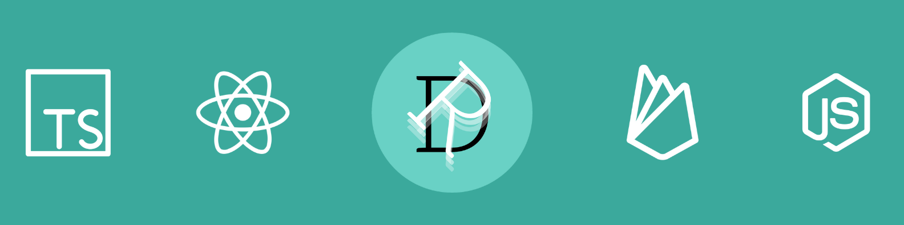

- 👋 Hi, I’m @deybyr647
- 👀 I’m interested in ...
- 🌱 I’m currently learning ...
- 💞️ I’m looking to collaborate on ...
- 📫 How to reach me ...

## 🔧 Technologies & Tools

  
  
  
  
  

  
  
  
  
   
  
  
  
   
  
  
    

<!---
deybyr647/deybyr647 is a ✨ special ✨ repository because its `README.md` (this file) appears on your GitHub profile.
You can click the Preview link to take a look at your changes.
--->

  
  

